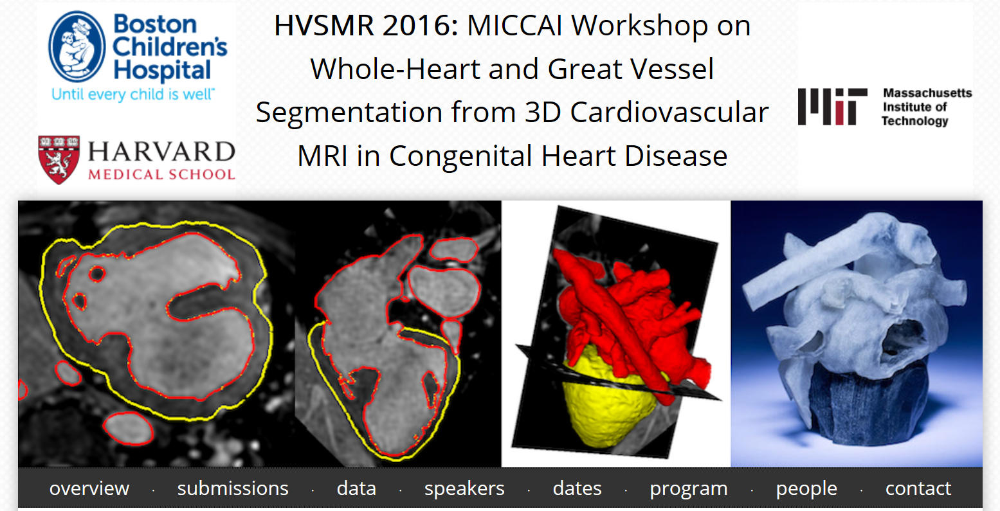
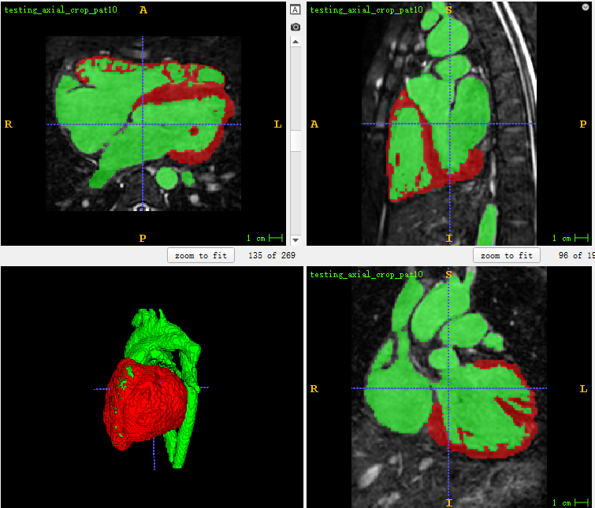
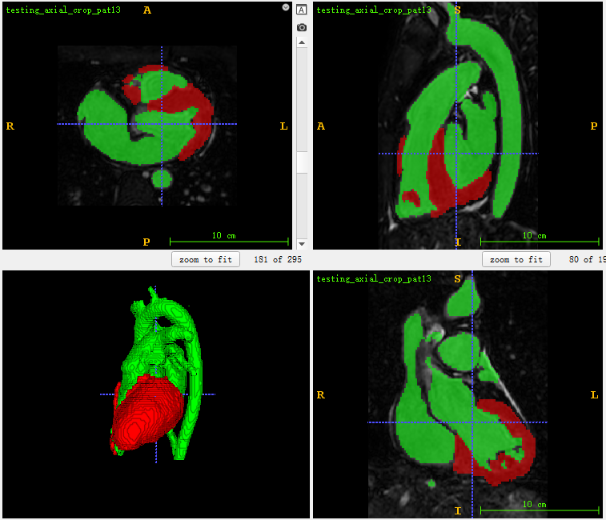
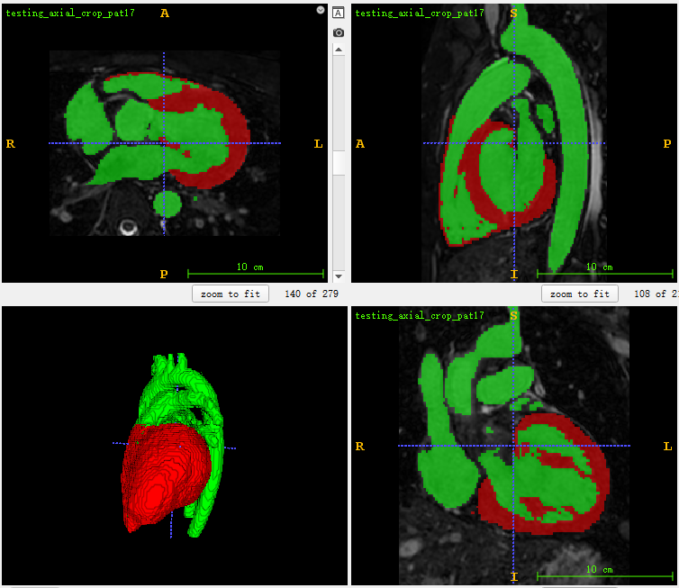
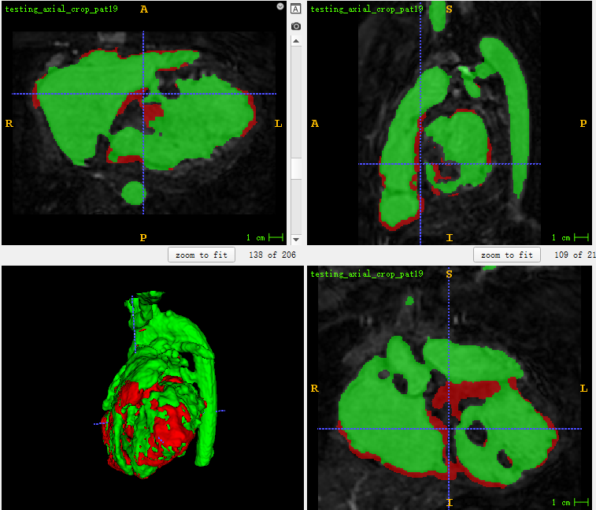

# Whole-Heart and Great Vessel Segmentation from 3D Cardiovascular MRI in Congenital Heart Disease
> This is an example of the MRI imaging is used to segment whole heart.

## Prerequisities
The following dependencies are needed:
- numpy >= 1.11.1
- SimpleITK >=1.0.1
- tensorflow-gpu ==1.14.0
- pandas >=0.20.1
- scikit-learn >= 0.17.1

## How to Use

**1、Preprocess**
* download MRI image data:http://segchd.csail.mit.edu/
* generate patch(96x96x96) image and mask image:run the data3dprepare.py

**2、HVSMR Segmentation**
* the mutlidepthVnet3d model can find here:https://github.com/junqiangchen/VNetFamily
* train and predict in the script of trainop.py and inferenceopt.py

## Result
* test dataset segmentation result

## Contact
* https://github.com/junqiangchen
* email: 1207173174@qq.com
* Contact: junqiangChen
* WeChat Number: 1207173174
* WeChat Public number: 最新医学影像技术
